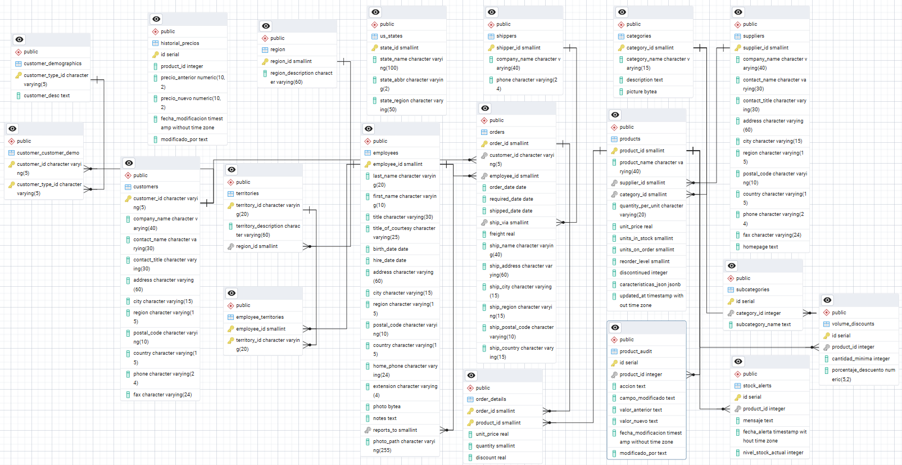

# northwind_postgres_modificado
# Proyecto Northwind PostgreSQL - Modificado

Este repositorio contiene una versión modificada de la base de datos Northwind para PostgreSQL, desarrollada como proyecto de curso con nuevas funcionalidades y mejoras.

## 📋 Descripción del Proyecto

La base de datos Northwind ha sido extendida con las siguientes mejoras:

### ✨ Nuevas Funcionalidades

- **Sistema de Categorías Jerárquicas**: Subcategorías para mejor organización
- **Agregue tablas,realice vistas,triggers.

-**Diagranma


## 🛠️ Tecnologías

- **PostgreSQL** 17 
- **pgAdmin** (opcional)
- **SQL Dump** para instalación rápida

## 📁 Estructura del Repositorio

```
northwind-postgres-modificado/
├── backup_northwind.sql    # incluye vistas  
├── northwind.sql     # BD completa original
├── README.md         # BD modificada
├── docs              # pdf
├── tree.txt        
├── Diagrama actualizado
    
```

### 🚀Instalación en 3 pasos

1. **Clonar repositorio**
```bash
git clone https://github.com/tu-usuario/northwind-postgres-modificado.git
cd northwind-postgres-modificado
```

2. **Crear base de datos**
```bash
createdb northwind_curso
```

3. **Restaurar dump completo**
```bash
psql -d northwind_curso -f northwind_curso.sql

**Alternativas usando pgAdmin Postgres
1.Crear base de datos
2.Abrir query tools
3.Copiar,pegar y ejecutar el contenido northwind_curso.sql
```

## 🔍 Funcionalidades Principales
Consultas y vistas de la base de datos northwind

### 1. Modificación de la tabla Products


### 2. Control de Stock Inteligente
```sql
-- Ver productos con stock bajo
SELECT * FROM vw_productos_stock_bajo;
```


### 3. Propuesta del alumno

Incluye aquí tu propuesta
🔍 Objetivo
Implementar un sistema que registre cada cambio de precio en los productos de forma automática, para mantener un historial detallado de precios. Esto permitirá realizar análisis de evolución de precios, detectar descuentos frecuentes y mejorar la toma de decisiones comerciales.

⚙️ Implementación Técnica
1. Crear una nueva tabla historial_precios
2. Crear una función para registrar los cambios de precio
La función registrar_cambio_precio() se encarga de detectar automáticamente cuándo se actualiza el precio (unit_price) de un producto en la tabla products, y en ese caso, registrar ese cambio en una nueva tabla llamada historial_precios.

Es parte de un sistema de auditoría automática de precios. Así, cada vez que se cambia el precio de un producto, el sistema guarda un registro con:

El product_id del producto afectado
El precio anterior
El nuevo precio
La fecha y hora del cambio
El usuario que hizo el cambio (current_user)
3. Crear el trigger asociado a la tabla products

📊 Ejemplo de consulta para ver el historial
🎯 Beneficios
Seguimiento detallado de cambios de precio.
Mejora en la trazabilidad de datos históricos.
Útil para auditorías, promociones y análisis comerciales.
Compatible con otras funcionalidades como alertas o análisis de tendencias.


## 📊 Nuevas Tablas Añadidas 
```sql
Creacion de la tabla subcategories y sus datos
- `subcategories` - Categorías jerárquicas

CREATE TABLE subcategories (
    id SERIAL PRIMARY KEY,
    category_id INT NOT NULL,
    subcategory_name TEXT NOT NULL
);

INSERT INTO subcategories (category_id, subcategory_name) VALUES
(1, 'Smartphones'),
(1, 'Laptops'),
(1, 'Tablets'),
(2, 'Auriculares'),
(2, 'Altavoces'),
(3, 'Teclados'),
(3, 'Ratones'),
(4, 'Monitores'),
(4, 'Proyectores'),
(5, 'Impresoras');
```

```sql

Creacion de la tabla volume_discounts y datos
- `volume_discounts` - Descuentos por cantidad

CREATE TABLE volume_discounts (
    id SERIAL PRIMARY KEY,
    product_id INT NOT NULL,
    cantidad_minima INT NOT NULL,
    porcentaje_descuento NUMERIC(5,2) NOT NULL
);

INSERT INTO volume_discounts (product_id, cantidad_minima, porcentaje_descuento) VALUES
(1, 10, 5.00),
(2, 20, 7.50),
(3, 15, 6.00),
(4, 50, 10.00),
(5, 100, 15.00),
(6, 25, 8.00),
(7, 30, 9.00),
(8, 40, 11.00),
(9, 60, 12.50),
(10, 80, 13.00);


``sql 
Creacion de tabla product_audit y datos
- `product_audit` - Auditoría de cambios

CREATE TABLE product_audit (
    id SERIAL PRIMARY KEY,
    product_id INT NOT NULL,
    accion TEXT NOT NULL, -- ejemplo: 'UPDATE', 'DELETE'
    campo_modificado TEXT,
    valor_anterior TEXT,
    valor_nuevo TEXT,
    fecha_modificacion TIMESTAMP DEFAULT CURRENT_TIMESTAMP,
    modificado_por TEXT
);

INSERT INTO product_audit (product_id, accion, campo_modificado, valor_anterior, valor_nuevo, modificado_por) VALUES
(1, 'UPDATE', 'unit_price', '599.99', '579.99', 'admin'),
(2, 'UPDATE', 'units_in_stock', '100', '80', 'jose'),
(3, 'DELETE', NULL, NULL, NULL, 'maria'),
(4, 'UPDATE', 'unit_price', '199.99', '189.99', 'luis'),
(5, 'UPDATE', 'unit_price', '89.99', '79.99', 'admin'),
(6, 'UPDATE', 'unit_price', '349.99', '319.99', 'soporte'),
(7, 'UPDATE', 'unit_price', '79.99', '69.99', 'ventas'),
(8, 'UPDATE', 'unit_price', '59.99', '49.99', 'admin'),
(9, 'UPDATE', 'unit_price', '99.99', '89.99', 'karla'),
(10, 'UPDATE', 'unit_price', '149.99', '129.99', 'luis');

``sql
Creacion de la tabla stock_alerts y datos
- `stock_alerts` - Alertas de inventario

CREATE TABLE stock_alerts (
    id SERIAL PRIMARY KEY,
    product_id INT NOT NULL,
    mensaje TEXT NOT NULL,
    fecha_alerta TIMESTAMP DEFAULT CURRENT_TIMESTAMP,
    nivel_stock_actual INT
);

INSERT INTO stock_alerts (product_id, mensaje, nivel_stock_actual) VALUES
(1, 'Stock por debajo del mínimo', 3),
(2, 'Producto agotado', 0),
(3, 'Reponer stock pronto', 7),
(4, 'Stock por debajo del mínimo', 5),
(5, 'Producto casi agotado', 2),
(6, 'Revisión urgente de inventario', 0),
(7, 'Stock por debajo del mínimo', 4),
(8, 'Nivel crítico de inventario', 1),
(9, 'Agotado en bodega principal', 0),
(10, 'Inventario por revisar', 6);
```

## 📈 Vistas Creadas

-1 `productos_stock_bajo` - Control de inventario

```sql
CREATE OR REPLACE VIEW productos_stock_bajo AS 
SELECT product_id,
    product_name,
    units_in_stock
   FROM products
  WHERE units_in_stock < 10;

-2 `ventas_mensuales` - Análisis temporal
CREATE OR REPLACE VIEW ventas_mensuales AS
SELECT date_trunc('month'::text, o.order_date::timestamp with time zone) AS mes,
    sum(od.unit_price * od.quantity::double precision) AS total_ventas
   FROM orders o
     JOIN order_details od ON o.order_id = od.order_id
  GROUP BY (date_trunc('month'::text, o.order_date::timestamp with time zone))
  ORDER BY (date_trunc('month'::text, o.order_date::timestamp with time zone));

-3 `top_productos_vendidos` - Ranking de productos
CREATE OR REPLACE VIEW top_productos_vendidos AS
SELECT p.product_id,
    p.product_name,
    sum(od.quantity) AS total_unidades_vendidas,
    sum(od.quantity::double precision * od.unit_price) AS total_ingresos
   FROM order_details od
     JOIN products p ON od.product_id = p.product_id
  GROUP BY p.product_id, p.product_name
  ORDER BY (sum(od.quantity)) DESC
 LIMIT 10;

-4 `analisis_clientes` - Segmentación de clientes
CREATE OR REPLACE VIEW analisis de clientes AS
SELECT c.customer_id,
    c.company_name,
    c.contact_name,
    c.country,
    c.city,
    count(o.order_id) AS total_pedidos,
    COALESCE(sum(od.quantity::double precision * od.unit_price * (1::double precision - od.discount)), 0::double precision)::numeric(10,2) AS total_gastado,
        CASE
            WHEN count(o.order_id) = 0 THEN 0::numeric
            ELSE round(sum(od.quantity::double precision * od.unit_price * (1::double precision - od.discount))::numeric / count(o.order_id)::numeric, 2)
        END AS promedio_por_pedido,
        CASE
            WHEN count(o.order_id) = 0 THEN 'Inactivo'::text
            WHEN sum(od.quantity::double precision * od.unit_price * (1::double precision - od.discount)) >= 10000::double precision THEN 'Premium'::text
            WHEN sum(od.quantity::double precision * od.unit_price * (1::double precision - od.discount)) >= 1000::double precision THEN 'Regular'::text
            WHEN sum(od.quantity::double precision * od.unit_price * (1::double precision - od.discount)) > 0::double precision THEN 'Ocasional'::text
            ELSE 'Inactivo'::text
        END AS segmento_cliente
   FROM customers c
     LEFT JOIN orders o ON c.customer_id::text = o.customer_id::text
     LEFT JOIN order_details od ON o.order_id = od.order_id
  GROUP BY c.customer_id, c.company_name, c.contact_name, c.country, c.city
  ORDER BY (COALESCE(sum(od.quantity::double precision * od.unit_price * (1::double precision - od.discount)), 0::double precision)::numeric(10,2)) DESC;

## 🔧 Funciones y Triggers

- **Auditoría automática** 

CREATE OR REPLACE FUNCTION registrar_cambio_precio()
RETURNS TRIGGER AS $$
BEGIN
  IF NEW.unit_price IS DISTINCT FROM OLD.unit_price THEN
    INSERT INTO product_audit(product_id, precio_anterior, precio_nuevo, modificado_por)
    VALUES (OLD.product_id, OLD.unit_price, NEW.unit_price, current_user);
  END IF;
  RETURN NEW;
END;
$$ LANGUAGE plpgsql;
- **Alertas de stock** cuando baja del mínimo
- **Cálculo de descuentos** por volumen de compra
SELECT calcular_descuento_volumen(1, 100);
- **Actualización automática** de timestamps

CREATE TRIGGER trg_auditoria_precio
AFTER UPDATE ON products
FOR EACH ROW
WHEN (OLD.unit_price IS DISTINCT FROM NEW.unit_price)
EXECUTE FUNCTION registrar_cambio_precio();

- **Alertas de stock** 

CREATE OR REPLACE FUNCTION generar_alerta_stock()
RETURNS TRIGGER AS $$
BEGIN
  IF NEW.units_in_stock < NEW.reorder_level THEN
    INSERT INTO stock_alerts(product_id, units_in_stock, reorder_level)
    VALUES (NEW.product_id, NEW.units_in_stock, NEW.reorder_level);
  END IF;
  RETURN NEW;
END;
$$ LANGUAGE plpgsql;

CREATE TRIGGER trg_alerta_stock
AFTER UPDATE ON products
FOR EACH ROW
WHEN (NEW.units_in_stock < NEW.reorder_level)
EXECUTE FUNCTION generar_alerta_stock();

- **Cálculo de descuentos** 

CREATE OR REPLACE FUNCTION calcular_descuento_volumen(
    producto_id INT,
    cantidad INT
)
RETURNS NUMERIC(5,2) AS $$
DECLARE
    descuento NUMERIC(5,2) := 0;
BEGIN
    SELECT COALESCE(MAX(porcentaje_descuento), 0)
    INTO descuento
    FROM volume_discounts
    WHERE product_id = producto_id
      AND cantidad_minima <= cantidad;

    RETURN descuento;
END;
$$ LANGUAGE plpgsql;

SELECT calcular_descuento_volumen(1, 100);  -- Resultado: 10.00

- **Actualización automática** de timestamps

ALTER TABLE products ADD COLUMN updated_at TIMESTAMP DEFAULT CURRENT_TIMESTAMP;

CREATE OR REPLACE FUNCTION actualizar_timestamp()
RETURNS TRIGGER AS $$
BEGIN
  NEW.updated_at = CURRENT_TIMESTAMP;
  RETURN NEW;
END;
$$ LANGUAGE plpgsql;

CREATE TRIGGER trg_actualizar_timestamp
BEFORE UPDATE ON products
FOR EACH ROW
EXECUTE FUNCTION actualizar_timestamp();

## 📋 Especificaciones Técnicas

- **Tamaño del dump**: 

-- Versión de PostgreSQL 17
SELECT version() AS "Versión de PostgreSQL";

-- Total de tablas 19 (13 originales y 6 nuevas)
SELECT count(*) AS "Total de Tablas"
FROM information_schema.tables
WHERE table_schema = 'public'
  AND table_type = 'BASE TABLE';

-- Total de vistas 21
SELECT count(*) AS "Total de Vistas"
FROM information_schema.views
WHERE table_schema = 'public';

-- Total de funciones definidas por el usuario 5
SELECT count(*) AS "Total de Funciones"
FROM pg_proc
WHERE pronamespace = (SELECT oid FROM pg_namespace WHERE nspname = 'public');

-- Total de triggers
SELECT count(*) AS "Total de Triggers"
FROM information_schema.triggers
WHERE trigger_schema = 'public';

-- Nombres de funciones
SELECT proname AS "Nombre de Función"
FROM pg_proc
WHERE pronamespace = (SELECT oid FROM pg_namespace WHERE nspname = 'public')
ORDER BY proname;

-- Nombres de triggers y tabla asociada
SELECT trigger_name AS "Trigger", event_object_table AS "Tabla"
FROM information_schema.triggers
WHERE trigger_schema = 'public'
ORDER BY event_object_table;

-- Tamaño total de la base de datos activa (opcional, útil si no sabes el dump exacto)
SELECT pg_size_pretty(pg_database_size(current_database())) AS "Tamaño total de la base de datos actual";


## 👨‍🎓 Información Académica

- **Curso**: Bases de Datos Avanzadas
- **Institución**: [Urko Formacion]
- **Autor**: [Fanny Fabiola Giron Diaz]
- **Fecha**: Junio 2025


